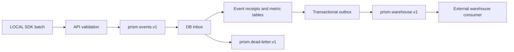

# 이슈 #28 Phase 4 — 실험 격리와 이벤트 확장

[이슈 #28](https://github.com/silbaram/prism/issues/28)의 Phase 4 다섯 항목을 구현한다. 기존 설정은 레이어 없음, 홀드아웃 미설정, sticky 비활성, DIRECT 수집, SDK 정기 폴링으로 동작한다.

## 1. 레이어 / 네임스페이스

`/admin/population`에서 레이어를 등록하고 실험 생성·수정 화면에서 레이어 키와 `[start, end)` 범위를 지정한다. 전체 공간은 0 이상 10000 미만이다. 예를 들어 같은 `checkout` 레이어에서 실험 A는 `[0, 5000)`, B는 `[5000, 10000)`을 사용한다. 사용자 ID와 레이어 키로 계산한 버킷이 해당 범위에 들어갈 때만 실험에 참여한다. 같은 레이어에서는 한 실험에만 참여하며 서로 다른 레이어의 실험은 병행할 수 있다.

Admin은 정책 행 잠금으로 동시 변경을 직렬화하고 범위 중복을 거부한다. 최초 시작 이후 범위와 sticky 옵션은 잠긴다. 종료 실험도 범위를 예약하므로 재사용하려면 새로운 레이어 키를 만든다. 기존 실험의 변형 해시, 참여 비율 해시는 유지하고 레이어와 홀드아웃에는 별도의 해시를 사용한다. 참여 비율·기간·타기팅도 모두 통과해야 한다.

SDK는 겹치는 레이어를 포함한 설정 전체를 거부하고 마지막 유효 설정을 유지한다. DB 직접 수정은 Admin 검증·감사·설정 전파를 우회하므로 지원하지 않는다. 시뮬레이터는 레이어/홀드아웃을 적용하지만 저장된 최초 배정은 조회하지 않는 미리보기다.

## 2. 영구 전역 홀드아웃과 누적 결과

Admin의 모집단 화면에서 키와 비율을 **한 번** 설정한다. 단위는 basis point이며 `500`은 5%이다. `0`으로 확정하면 이후에도 홀드아웃을 켤 수 없다. 설정 후 키와 비율은 변경할 수 없다. 비율을 유지해 동일 사용자가 모든 실험에서 계속 제외되도록 한다. 기존 노출을 되돌리지는 않으므로 새 정책 활성화 시점부터 관측한다.

LOCAL/REMOTE 배정 모두 홀드아웃 사용자를 제외한다. LOCAL SDK는 다음 API로 실험 참여 가능 집단과 홀드아웃 집단의 결과를 별도로 기록한다.

```kotlin
// 공통 서비스 진입 시 모든 사용자에게 실행한다. 실험 참여/전환 여부로 호출을 제한하지 않는다.
val populationRecorded = experiments.recordPopulationExposure(userId)
val holdout: Boolean? = experiments.isInHoldout(userId)
// null: 정책 미설정, 초기 설정 미수신, 잘못된 ID 또는 클라이언트 종료

// 실험 경험을 실제 제공할 때 기존 assign/evaluate + recordExposure 사용
val assignment = experiments.assign(userId, "checkout")

// 구매가 발생한 시점. 홀드아웃 사용자에게도 같은 계측을 실행한다.
val queued = experiments.trackPopulationConversion(userId, "purchase")
```

전환 기록에는 같은 client에서 먼저 등록한 모집단 노출이 필요하다. 전환한 사용자에게만 노출을 만들면 비교 모집단이 편향된다. 모집단 노출은 client 수명 동안 사용자별 한 번이며 `exposureDedupCapacity`로 제한한다. 프로세스 재시작 후 서비스 진입 시 다시 계측한다. REMOTE SDK의 모집단 편의 API는 지원하지 않으므로 이 계측은 LOCAL client를 사용한다.

`population_exposures`, `population_conversions`에 별도 저장하며 실험의 노출 수/SRM/CVR에 섞지 않는다. Admin은 집단별 고유 사용자 수와 노출 이후 전환한 고유 사용자 수를 표시한다. 누적 비교용 기술 통계이며 유의성·인과 효과를 자동 선언하지 않는다. ELIGIBLE은 실제 특정 실험에 노출됐다는 뜻이 아니라 전체 실험에 참여할 수 있는 모집단이다.

## 3. Sticky bucketing

실험 생성 시 `stickyBucketing`을 켜면 사용자×실험의 최초 평가 변형을 저장하고 이후에도 사용한다. 기간, 상태, 타기팅, 레이어, 홀드아웃에 의한 미참여는 여전히 적용된다. 저장된 변형이 새 설정에서 사라지면 재배정하지 않고 미참여로 처리한다. Phase 2의 시작 후 변형/타기팅 잠금은 유지한다.

- REMOTE: `sticky_assignments` DB에 최초 배정을 원자적으로 저장하여 API 인스턴스와 재시작 간에 공유한다.
- LOCAL 기본: `InMemoryStickyAssignmentStore`가 client 수명 동안 유지한다. 기본 100,000개 한도에서 자동 퇴출하지 않으며 신규 저장을 거부한다.
- LOCAL 영속화: `FileStickyAssignmentStore`를 지정하면 파일 잠금, 원자적 rename, fsync를 사용하여 동일 호스트의 프로세스와 재시작 간에 유지한다. 디렉터리는 프로젝트·운영 환경별로 분리한다. 지원하는 로컬 파일시스템과 영속 볼륨이 필요하다.
- 여러 호스트에서 사용자 배정을 공유하려면 `StickyAssignmentStore.getOrPut`을 구현한 공용 저장소를 주입한다. 구현은 사용자×실험별 최초 쓰기와 읽기를 원자적으로 보장해야 한다. 파일 저장소만으로 호스트 간 공유를 보장하지 않는다.

```kotlin
val client = PrismClient("https://prism.example", options = PrismClientOptions(
    apiKey = requireNotNull(System.getenv("PRISM_CLIENT_API_KEY")),
    stickyAssignmentStore = FileStickyAssignmentStore(java.nio.file.Path.of("/var/lib/my-app/prism-prod")),
    configStreaming = true
))
```

`evaluate()`도 sticky 최초 배정을 저장할 수 있지만 실험 노출 이벤트는 생성하지 않는다. 저장소 실패 시 다른 변형으로 배정하지 않고 평가가 실패한다.

## 4. Kafka 수집 → DB 집계 → 웨어하우스용 스트림

기본 `DIRECT`는 기존 `/v1/events` 동기 저장을 유지한다. `KAFKA` 모드에서는 다음 경로를 사용한다.



API용 Spring 설정 예시:

```yaml
prism:
  pipeline:
    mode: KAFKA
    bootstrap-servers: localhost:9092
    topic: prism.events.v1
    warehouse-topic: prism.warehouse.v1
    dead-letter-topic: prism.dead-letter.v1
    group-id: prism-materializer-v1
    consumer-enabled: true
    max-outbox-rows: 100000
    # 필요하면 security.protocol, sasl.mechanism, sasl.jaas.config,
    # ssl.truststore.location 등의 Kafka 속성을 client-properties로 전달한다.
```

세 토픽과 consumer group은 Prism DB/운영 환경별로 분리한다. 운영에서는 토픽을 미리 만들고 복제 수·min.insync.replicas·보존 기간을 장애 복구 시간에 맞춘다. producer는 `acks=all`, idempotence를 강제한다. 로컬 브로커만 실행하려면 `docker compose -f docker/docker-compose.kafka.yml up -d`를 사용한다. 이 단일 노드 설정은 개발용이다. 설정 기준은 [Apache Kafka 4.1 공식 Compose 예시](https://github.com/apache/kafka/blob/4.1.0/docker/examples/docker-compose-files/single-node/plaintext/docker-compose.yml)다.

HTTP 결과 `QUEUED`는 Kafka의 내구성 있는 수신 확인이며 DB 반영 완료를 뜻하지 않는다. 이후 귀속 검증에서 거부될 수 있으며 이 결과는 DLQ로 확인한다. SDK는 재전송 큐에서 제거하되 선행 노출 참조를 보존하여 DB 조회 캐시가 만료돼도 전환을 등록할 수 있다. Kafka 수신 실패/시간 초과는 `RETRY`이고 DB 직접 저장으로 자동 전환하지 않는다. 기존 REMOTE `/v1/assign`, `/v1/conversions`는 동기 DB 계약을 유지하며 이 스트림을 거치지 않는다.

consumer는 DB inbox 저장 후 Kafka offset을 커밋한다. materializer는 짧은 트랜잭션으로 1분 처리 임대를 확보한 뒤 DB 연결을 반환하고 처리한다. 중간에 프로세스가 종료되면 임대 만료 후 다시 처리한다. 기존 영수증 중복 제거를 재사용하고 지표 로그와 warehouse outbox를 같은 트랜잭션으로 저장한다. 노출보다 먼저 도착한 전환은 최대 7일간 1~60초 간격으로 재시도한다. 잘못된 이벤트·충돌한 ID·기간 초과는 DLQ outbox로 보낸다. DLQ는 원문 최대 65,536자, 잘림 여부, 전체 payload SHA-256, 사유를 포함한다. 수신 단계에서 거부한 이벤트에는 Kafka `topic:partition:offset`도 포함한다.

warehouse 토픽은 검증·귀속이 끝난 `ClientEvent` JSON이고 Kafka key는 `eventId`다. 필드는 `eventId`, `type`, `userId`, `experimentKey`, `variant`, `timestamp`, `configVersion`, 선택적 `eventName`, `exposureEventId`다. type은 `exposure`, `conversion`, `population_exposure`, `population_conversion`이다. population 이벤트의 `experimentKey`는 홀드아웃 정책 키다. 출력 확인 후 outbox를 삭제하므로 출력 직후 DB 장애가 나면 같은 ID가 반복될 수 있다. **외부 웨어하우스 sink는 eventId를 기본 키로 upsert/중복 제거해야 한다.** 토픽 간 전역 순서는 보장하지 않는다.

외부 BigQuery/Snowflake 등의 계정·테이블·커넥터 배포는 포함하지 않는다. 이 구현의 출력 경계는 검증된 fact 스트림이며, 해당 웨어하우스 consumer를 연결해 사용한다. Kafka/DB 이후 처리는 재시도 가능하지만 SDK의 송신 전 큐는 기존 메모리 방식이므로 프로세스 강제 종료에 대한 내구성은 제공하지 않는다.

API 노드에서 `consumer-enabled: false`로 두면 수집만 수행한다. 같은 DB와 토픽을 사용하는 다른 API 프로세스에서 `true`로 materializer/exporter를 실행한다. 적어도 하나의 worker가 필요하다. worker가 여러 개여도 DB 행 잠금과 event receipt로 중복 반영을 막는다. outbox가 `max-outbox-rows`에 도달하면 Kafka 소비를 일시 중지하고 출력이 진행되면 재개한다. 선행 노출을 기다리는 inbox는 소비 중지 조건에서 제외한다. 필요한 노출이 뒤에 있어도 계속 읽을 수 있어야 하기 때문이다. 대기 inbox 크기와 7일 재시도 기간의 저장 공간은 별도로 관측한다. Kafka 원본은 보존 기간 동안 유지되므로 backlog와 consumer lag를 함께 관측해야 한다.

운영 조회 예시(읽기 전용):

```sql
SELECT status, COUNT(*) AS rows_count, MIN(created_at) AS oldest FROM pipeline_inbox GROUP BY status;
SELECT kind, COUNT(*) AS rows_count FROM pipeline_outbox GROUP BY kind;
```

DONE/REJECTED inbox와 영수증은 자동 삭제하지 않는다. 보존·재처리 정책을 별도로 운영하고 영수증을 지우면 중복 방지 보장도 사라진다는 점을 고려한다. 미수신 이벤트 재전송은 원래 eventId와 payload를 그대로 입력 토픽에 재발행한다. 이미 REJECTED인 inbox는 같은 payload 재발행만으로 재처리되지 않는다. 거부 사유를 해결한 후 운영자가 DLQ의 payloadHash와 일치하는 inbox 행을 확인하고 status를 PENDING, retry_at을 현재 UTC 시각으로 변경해야 한다. 거부된 payload를 고쳐 보내려면 새 eventId를 사용하고 연관 전환의 참조도 수정해야 한다. 영구 거부 이벤트를 확인하는 동안 원본 Kafka 보존 기간이 지나지 않도록 한다.

## 5. SSE 설정 전파

`GET /v1/config/stream`은 기존 SDK API 키 인증을 사용하는 SSE endpoint다. Admin의 설정 변경은 공통 정책 잠금으로 감사 ID 순서와 커밋 순서를 맞춘다. API별로 공유 DB의 감사 revision을 500ms 주기로 확인하고 변경된 전체 설정을 `event: config`로 보낸다. 프로세스당 최대 512개 연결, 15초 heartbeat, 60초 연결 수명과 SDK 자동 재연결을 사용한다. 느린 구독자는 다른 구독자의 전송을 막지 않는다.

SDK의 `configStreaming = true` 또는 스타터의 `prism.client.config-streaming: true`로 활성화한다. 설정은 원자적으로 교체하고 이전 revision을 거부한다. 스트림 장애 시 마지막 유효 설정과 기존 조건부 HTTP 폴링을 유지하며 1~30초 backoff로 재연결한다. DB 변경 감지·전송 시간이 있으므로 즉시 일관성을 보장하지 않는다. 프록시의 응답 버퍼링을 끄고 SSE 연결·API 키 헤더를 통과시킨다.

## 배포 순서와 검증

1. Phase 3의 031까지 적용된 DB를 기준으로 한다. 먼저 SDK/스타터를 이 버전으로 올리고 레이어/홀드아웃/sticky 기능과 KAFKA 모드는 아직 활성화하지 않는다. 이전 SDK는 새 필드를 무시하거나 `QUEUED`를 해석하지 못한다.
2. API/Admin 쓰기를 중단하고 백업 후 `prism-infrastructure/src/main/resources/migrations/032_experiment_scale.sql`을 **한 번** 적용한다. 새 DB는 최신 `schema.sql`을 사용한다. 자동 마이그레이션은 수행하지 않는다.
3. 새 API/Admin을 배포한다. 필요하면 Kafka 토픽/worker/warehouse sink를 준비하고 KAFKA 모드로 전환한다. 환경 내 수집 노드의 모드를 일치시킨다.
4. 전체 SDK 업그레이드와 사용자 ID의 일관성을 확인한 뒤 정책·레이어·sticky 실험을 활성화한다. SSE와 파일 저장소는 각각 명시적으로 켠다.

```bash
./gradlew clean build
PRISM_TEST_MYSQL_URL='jdbc:mysql://127.0.0.1:33328/?allowPublicKeyRetrieval=true&useSSL=false' \
PRISM_TEST_MYSQL_USERNAME=root ./gradlew :prism-api:mysqlTest
PRISM_TEST_KAFKA_BOOTSTRAP=127.0.0.1:9092 ./gradlew :prism-api:kafkaTest
```

일반 테스트는 실제 Kafka/MySQL을 요구하지 않는다. MySQL 테스트는 임의 이름 DB를 만들고 제거하며 신규/기존 스키마와 UTC/Asia-Seoul JVM을 검증한다. Kafka 테스트는 임의 이름 토픽/group을 사용하므로 테스트 전용 브로커를 사용한다. 전체 build에는 Maven POM/Gradle module metadata로 SDK를 별도 해석하는 Java consumer 검증이 포함된다.

2026-09-13 개발 검증: 전체 build와 일반 테스트 176개, 실제 MySQL 4개(신규/업그레이드 × UTC/Asia-Seoul), Kafka 4.1 브로커 통합 테스트 1개, 별도 Java consumer 2개를 통과했다. 로컬 환경에서는 Docker 실행이 불가능해 MySQL과 Kafka를 네이티브 프로세스로 실행했다. Compose 파일은 공식 설정을 기준으로 작성했으며 컨테이너 실행 검증은 수행하지 않았다.


## 개발 후 리뷰 수정

- REMOTE 배정의 바깥 트랜잭션을 제거하고, inbox 처리에는 짧은 임대 트랜잭션을 사용한다. 배정/집계 도중 두 번째 DB 연결을 기다리는 상황을 제거했다. API와 MySQL 검증에서 연결 풀 크기 1로도 처리와 중복 제거가 완료되는 것을 확인했다.
- Kafka 소비 제한은 출력 대기 outbox를 기준으로 한다. 노출을 기다리는 전환이 입력 소비를 막는 순환 대기를 제거했다. 실제 브로커에서 outbox 제한 1, 전환 선행 도착 조건을 검증했다.
- 시작·일시정지·예약 실행도 공통 정책 잠금을 거쳐 설정 감사 revision의 커밋 순서를 보장한다. 서로 다른 실험의 동시 시작 테스트로 확인했다.
- SSE는 줄바꿈 없는 입력도 읽는 도중 크기를 제한한다. 빈 200 응답만 반복되는 경우에는 backoff를 초기화하지 않으며, 재연결 때마다 API 키를 전달한다. 입력 제한, 재연결 간격, 인증 유지 회귀 테스트를 추가했다.
- worker 중단 후 임대 만료로 inbox가 다시 처리되는 경우와 DLQ의 재처리 방법을 확인했다. 일반 테스트 176개, MySQL 4개, Kafka 1개 및 별도 Java consumer 2개에서 실패·건너뜀 없이 통과했다.
